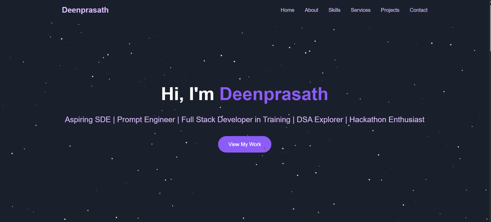

# 🚀 TechClub - College Club Website
### 🧑‍💻 Developed by: **S. DeenPrasath**

A modern, fully responsive multi-page website built for a college Tech Club using HTML, CSS, and JavaScript. It showcases club activities, upcoming events, team members, gallery highlights, and contact options — all with stylish animations and responsive design.

---

## 🔗 Live Demo

👉 **[Click here to view the live project](https://Deenprasath.github.io/college-club-website/)**

> ✅ Make sure GitHub Pages is enabled from the repository's settings (`main` branch / root).

---

## 🌟 Features

- 🎯 Animated Hero section with parallax effect
- 📚 About section with club story, mission, and vision
- 🗓️ Events with interactive cards and registration
- 👥 Members: core team and active contributors
- 🖼️ Gallery with lightbox preview of event photos
- 📬 Contact form with validation and fake send simulation
- 📱 Fully mobile responsive with hamburger menu
- 🎨 Custom gradients, glassmorphism cards, and modern UI

---

## 🛠 Tech Stack

- `HTML5` – Structure
- `CSS3` – Custom styling and responsiveness
- `JavaScript (Vanilla)` – DOM interactivity, gallery, form logic

---

## 📁 Project Structure

