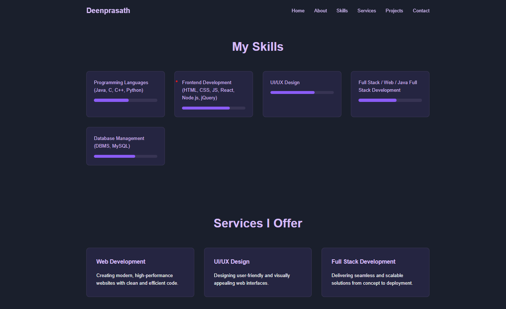
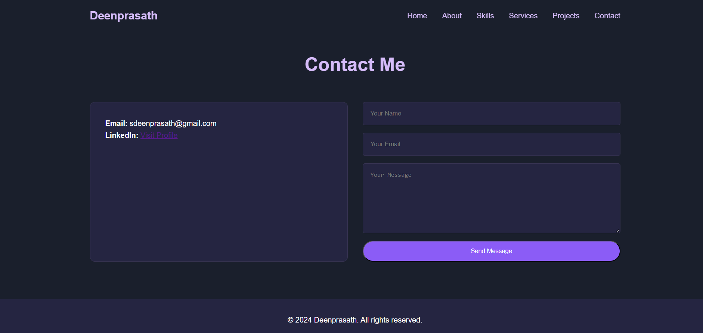

# 🌟 Deenprasath - Personal Portfolio Website

Welcome to my **personal portfolio website**! This project showcases my profile, skills, services, and projects as a Full Stack Developer and Tech Enthusiast. The site includes a beautifully animated UI, responsive layout, and a working contact form integrated with **FormSubmit**.

---

## 🚀 Live Demo

🔗 [Click Here to Visit the Live Website](https://deenprasath.github.io/Portfolio-webpage/)

---

## 📸 Screenshots

### 🔹 Hero Section with Animated Background

### 🔹 Skills and Services Sections

### 🔹 Contact Form with AJAX + FormSubmit

---

## 🧰 Built With

- **HTML5**
- **CSS3**
- **JavaScript (Vanilla JS + DOM + Canvas Animations)**
- **FormSubmit** – for contact form handling without backend
- **Flask (Optional)** – to serve the HTML locally using `app.py`

---

## 📁 Folder Structure

portfolio/
├── templates/
│ └── index.html # Main webpage
├── static/
│ └── event1.css # CSS styles
├── app.py # Flask server (optional for preview)
├── screenshots/ # Screenshots for README
├── README.md # Project info (this file)

